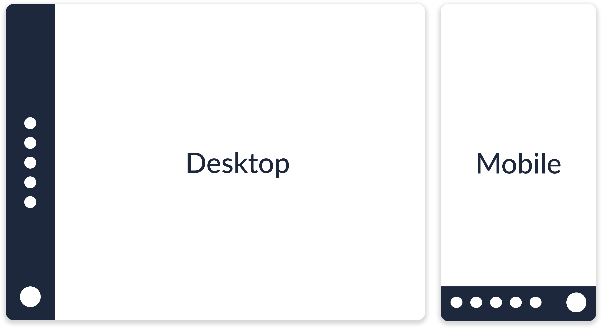

# Kapitel 2 - Frontend
## Flexbox
Flexbox, offiziell CSS Flexible Box Layout Module, ist eine neue Art und ein neues Konzept um eindimensionale Layouts auf Webseiten umzusetzen. Die herkömmliche Art Objekte auf einer Webseite zu positionieren ist, fixe Positionen und Maße zu vergeben. 

Doch bei Flexbox werden bestimmte Regeln festgelegt, diese machen das Verhalten der Webseite vorhersagbar bei einer Veränderung der Bildschirmgröße. Anschließend ist es dem Browser überlassen, die Breite, Höhe, Position und Anordnung zu wählen. 

#### Das Konzept
Die Grundidee ist es, dem Flex-Container die Möglichkeit zu geben, die Breite/Höhe der Elemente so zu verändern, dass der Platz auf unterschiedlichen Bildschirmaufslösungen bestmöglich ausgenutzt ist. 

#### technische Spezifikation
Innerhalb eines Divs können die einzelnen Elemente ihre Größe "flexibel" verändern. Sie wachsen, um freien Platz zu verwenden oder schrumpfen, um innerhalb des Elternobkjekts zu bleiben und einen Overflow zu vermeiden.

#### Erklärung anhand eines realen Beispiels
Auf dem Dashboard soll eine seitliche Navigation angezeigt werden, die auf mobilen Geräten an den unteren Rand des Bildschirms wandert, siehe Abbildung 1. 



Mithilfe von Flexbox ist dieses Verhalten einfach zu erzielen.	
Ich erstelle ein Elternelement mit folgenden Eigenschaften:


```Sass
.parent{
  display: flex;
  overflow: hidden;
}
```
Die Tochterelemente dieser Flexbox werden auf der horizontalen Hauptachse ausgerichtet. Der Overflow auf der X- und Y-Achse wird ausgeblendet. Die Navigation auf der Seite ist in folgendem Code-Block beschrieben.

```Sass
.side-nav{
  display: flex;
  order: 1;
  justify-content: center;
  align-items: center;
  flex-direction: column;
}
```
Dieses Element ist durch order:1 das erste Element in der Flexbox. Der Overflow auf der Y-Achse ist versteckt, um die Leiste zu fixieren. 

```Sass
.content{
  overflow-y: hidden;
  display: flex;
  justify-content: center;
  flex-direction: column;
  order: 2;
}
```


```Sass
@media (max-width: 576px){
  .parent{
    flex-direction: column;	//changed
  }

  .side-nav{
      order: 2;					//changed
      width: 100vw;				//changed
      height: 66px;				//changed
    }
  }
```
